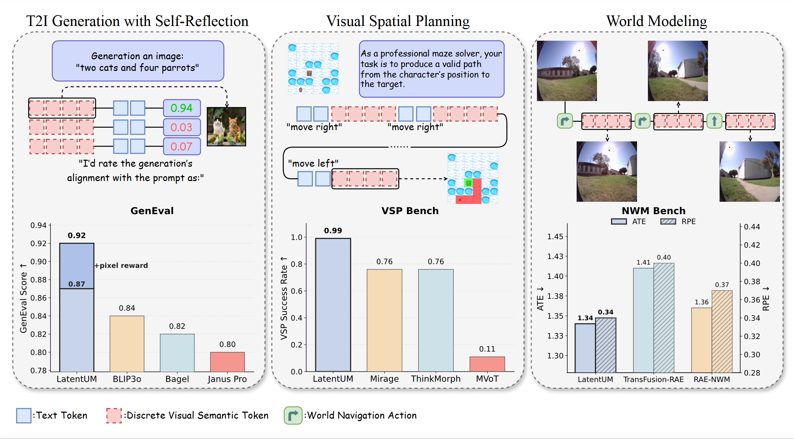
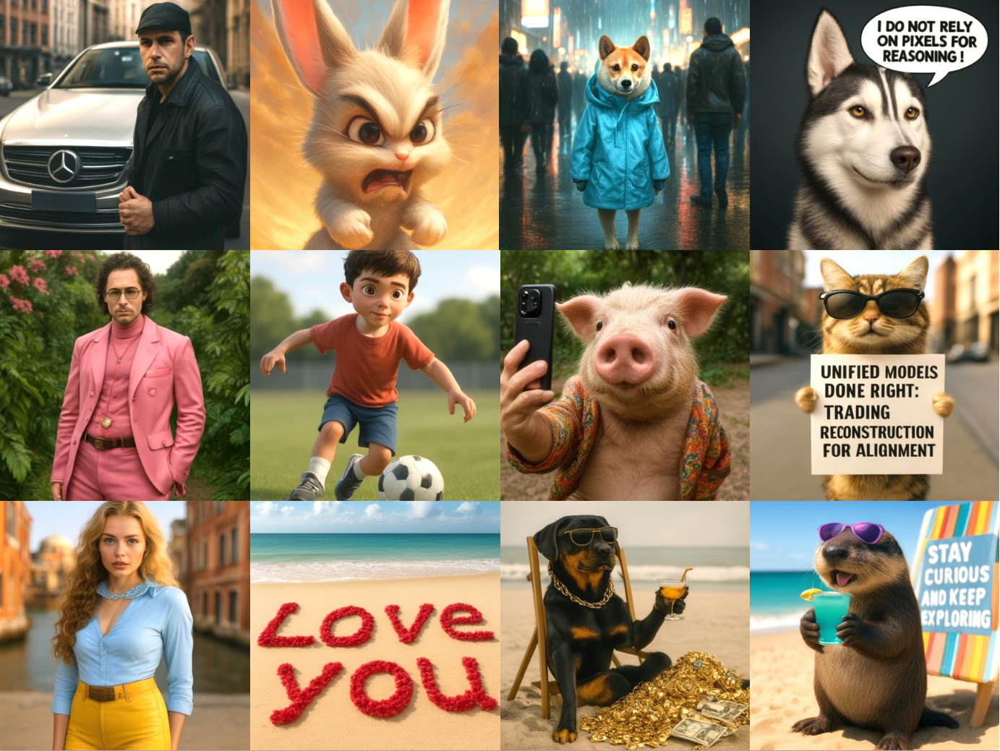
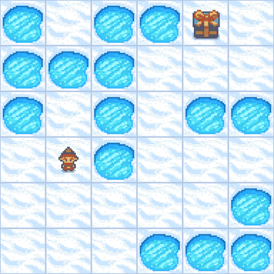
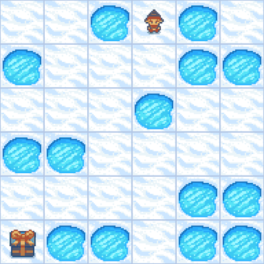
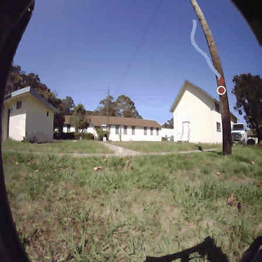

<div align="center">

# LatentUM: Unleashing the Potential of Interleaved Cross-Modal Reasoning via a Latent-Space Unified Model

Jiachun Jin<sup>1</sup>, Zetong Zhou<sup>1</sup>, Xiao Yang<sup>2</sup>, Hao Zhang<sup>3</sup>, Pengfei Liu<sup>1</sup>, Jun Zhu<sup>2</sup>, Zhijie Deng<sup>1</sup>

<sup>1</sup>Shanghai Jiao Tong University &nbsp;&nbsp; <sup>2</sup>Tsinghua University &nbsp;&nbsp; <sup>3</sup>UCSD

[](https://arxiv.org/abs/2604.02097)
[](https://huggingface.co/collections/SJTU-DENG-Lab/latentum)
<!-- [](PROJECT_PAGE_URL)
[](LICENSE) -->

</div>

<p align="center">

</p>

## Overview

**LatentUM** unifies all modalities within a shared semantic latent space, enabling interleaved cross-modal reasoning without pixel-space mediation. Unlike existing unified models that require pixel decoding as a bridge between understanding and generation, LatentUM reasons directly over its own generated visual content.

## Key Features

- **Shared Semantic Latent Space:** Text and visual tokens share the same space, enabling direct cross-modal reasoning over generated visual content.
- **MBAQ:** Visual tokenizer trained to preserve VLM understanding behavior rather than pixel reconstruction.
- **MoME:** Decoupled understanding/generation branches with shared self-attention for cross-modal interaction.
- **Decoupled Pixel Decoder:** Optional diffusion decoder for pixel rendering, trained independently to keep the latent space semantics-focused.

## Demos

### T2I Generation

<p align="center">

</p>

### Visual Spatial Planning
<div class="container">
    
    
</div>

### World Modeling

<div class="container">
    
    
</div>


## Getting Started

### Installation

```bash
git clone https://github.com/SJTU-DENG-Lab/LatentUM.git
cd LatentUM
uv sync
```

### Model Weights

Pre-trained weights are available on [HuggingFace](HUGGINGFACE_URL):

| Model | Base | Description | Download |
|-------|------|-------------|----------|
| LatentUM_Base | InternVL3.5-4B | Base model for understanding + generation | [Link](https://huggingface.co/SJTU-DENG-Lab/LatentUM-Base) |
| LatentUM_Vis-Plan | LatentUM_Base | Fine-tuned for visual spatial planning | [Link](https://huggingface.co/SJTU-DENG-Lab/LatentUM-Vis-Plan) |
| LatentUM_WM | LatentUM_Base | Fine-tuned for action-conditioned world modeling | [Link](https://huggingface.co/SJTU-DENG-Lab/LatentUM-WM) |
| LatentUM_GenEval | LatentUM_Base | Fine-tuned for GenEval with self-reflection + pixel reward | [Link](https://huggingface.co/SJTU-DENG-Lab/LatentUM-Vis-Plan) |
| Decoupled Pixel Decoder | stable-diffusion-3-medium | Pixel decoder | [Link](SJTU-DENG-Lab/LatentUM-Decoder) |

### Examples

#### Image Understanding

```bash
uv run python - <<'PY'
import torch

from model.latentum import LatentUMModel

dtype = torch.bfloat16
device = "cuda" if torch.cuda.is_available() else "cpu"

model = LatentUMModel.from_pretrained(
    "SJTU-DENG-Lab/LatentUM-Base",
    device = device,
    dtype  = dtype,
)
answer = model.answer(
    "asset/blue_apple.png",
    "Describe this image.",
)
print(answer)
PY
```

#### Image Generation

```bash
uv run python - <<'PY'
import torch

from model.decoder import LatentUMDecoderModel
from model.latentum import LatentUMModel

dtype = torch.bfloat16
device = "cuda" if torch.cuda.is_available() else "cpu"

model = LatentUMModel.from_pretrained(
    "SJTU-DENG-Lab/LatentUM-Base", # alternative: "SJTU-DENG-Lab/LatentUM-GenEval"
    device = device,
    dtype  = dtype,
)
decoder = LatentUMDecoderModel.from_pretrained(
    "SJTU-DENG-Lab/LatentUM-Decoder",
    device=device,
    dtype=dtype,
)
images = model.generate_images(
    "a photo of a cute dog",
    decoder       = decoder,
    show_progress = True,
)
images[0].save("generated.png")
print("saved to generated.png")
PY
```

#### Visual Spatial Planning

```bash
uv run python - <<'PY'
import torch

from model.decoder import LatentUMDecoderModel
from model.latentum import LatentUMModel
from model.latentum.spatial_planning import run_frozenlake_demo

dtype = torch.bfloat16
device = "cuda" if torch.cuda.is_available() else "cpu"

model = LatentUMModel.from_pretrained(
    "SJTU-DENG-Lab/LatentUM-Vis-Plan",
    device=device,
    dtype=dtype,
)
decoder = LatentUMDecoderModel.from_pretrained(
    "SJTU-DENG-Lab/LatentUM-Decoder",
    device=device,
    dtype=dtype,
)
result = run_frozenlake_demo(
    model,
    decoder,
    image                    = "asset/frozenlake_level6_000.png",
    output_dir               = "asset/frozenlake_demo",
    max_steps                = 16,
    max_text_tokens_per_step = 10,
    temperature              = 0.7,
    top_k                    = 50,
    top_p                    = 0.95,
    gif_duration             = 500,
)
print(result["full_text"])
print("saved to asset/frozenlake_demo")
print(f"gif saved to {result['gif_path']}")
PY
```

#### World Modeling

```
python script/run_latentum_wm.py 
```


## Citation

If you find this work useful, please cite:

```bibtex
@article{jin2026latentum,
  title   = {LatentUM: Unleashing the Potential of Interleaved Cross-Modal Reasoning via a Latent-Space Unified Model},
  author  = {Jiachun Jin and Zetong Zhou and Xiao Yang and Hao Zhang and Pengfei Liu and Jun Zhu and Zhijie Deng},
  journal = {arXiv preprint arXiv:2604.02097},
  year    = {2026},
  url     = {https://arxiv.org/abs/2604.02097}
}
```
## Acknowledgements

We thank the authors of InternVL, BLIP3o, UniTok, and Stable Diffusion 3.5 for open-sourcing their models and data.

## License

This project is released under the [Apache 2.0 License](LICENSE).
